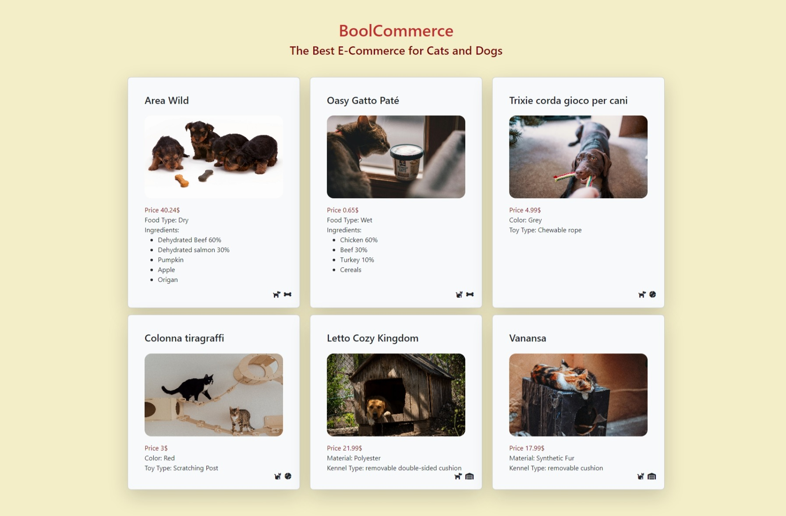

# PHP OOP E-Commerce

Creazione di un e-commerce per la vendita di prodotti per cani e gatti.



## Classi

### Shop

Questa classe definisce il mio E-Commerce.

_Variabili_

`$name` --> nome del sito

`$catalog` --> array che raccoglie tutti gli oggetti dello Shop

_Metodi_

`addToCatalog($_product)` --> aggiunge a `$catalog` un prodotto

`printCatalogProduct($prodotto)` --> stampa le variabili di un prodotto

NB: è strettamente legata alla funzione `printProduct()`

---

### Category

_Variabili_

Definisce le due categorie principali del sito

`CANI` --> 'cani';

`GATTI` --> 'gatti';

---

### Product

Classe che definisce il prodotto generico nel sito

_Variabili_

`$type` --> definisce di che tipo è l' oggetto (food, toy, kettel)

`$name` --> definisce il nome del prodotto

`$price` --> definisce il prezzo del prodotto

`$image` --> definisce l' src dell' immagine (salvata localmente in img)

`$category` --> definisce se il prodotto è per cane o gatto

_Metodi_

`_construct` --> per inizializzare l' istanza

`getType()` --> restituisce il `$type` dell' oggetto

si ripete per ogni variabile della classe

`printProduct()` --> stampa le varibili del prodotto

---

### Food figlia di Product

Classe che definisce il prodotto di tipo food nel sito

_Variabili_

`$food_type` --> definisce di che la tipologia di cibo

`$ingredients` --> array che raccogli gli ingredienti

`$expiration_date` --> definisce la data di scadenza

`$allergens` --> array che raccogli gli allergeni

_Metodi_

`_construct` --> per inizializzare l' istanza

`getFoodType()` --> restituisce il `$food_type` dell' oggetto

si ripete per ogni variabile della classe

`printProduct()` --> stampa le varibili del prodotto

NB `_construct` e `printProduct()` richiamano le funzioni del padre

---

### Toy figlia di Product

Classe che definisce il prodotto di tipo toy nel sito

_Variabili_

`$color` --> definisce il colore del gioco

`$toy_type` --> definisce di che tipo è il gioco

_Metodi_

`_construct` --> per inizializzare l' istanza

`getColor()` --> restituisce il `$color` dell' oggetto

si ripete per ogni variabile della classe

`printProduct()` --> stampa le varibili del prodotto

NB `_construct` e `printProduct()` richiamano le funzioni del padre

---

### Kennel figlia di Product

Classe che definisce il prodotto di tipo kennel nel sito

_Variabili_

`$material` --> definisce il materiale della cuccia

`$kennel_type` --> definisce di che tipo di cuccia

_Metodi_

`_construct` --> per inizializzare l' istanza

`getMaterial()` --> restituisce il `$material` dell' oggetto

si ripete per ogni variabile della classe

`printProduct()` --> stampa le varibili del prodotto

NB `_construct` e `printProduct()` richiamano le funzioni del padre

## Logica

Partendo da un `database` creo le istanze da inserire nel catalogo del sito.

Una volta raccolti tutti i prodotti in `$catalog` lo userò per stampare i dati in pagina.

```php
//creo il mio oggetto negozio
$shop = new Shop('Nome Shop');

//aggiungo i cibi al catalogo
foreach ($foods as $food) {
    $food = new Food($food['type'], $food['name'], $food['price'], $food['image'], $food['category'], $food['food_type'], $food['ingredients'], $food['expiration_date'], $food['allergens'],);
    $shop->addToCatalog($food);
};

//ripeto per toy e kennel
```

## Creazione delle cards

Per creare le cards uso un `foreach` sul `$catalog` e in base a quello che volgio stampare richiamo i metodi getter.

Per la stampa delle informazioni corrette uso `if` e `else-if` con controllo sulla category (dog e cat) e sul type (food, toy e kennel).
